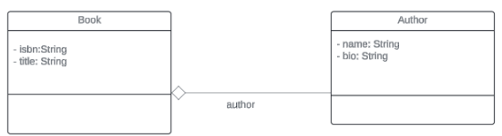
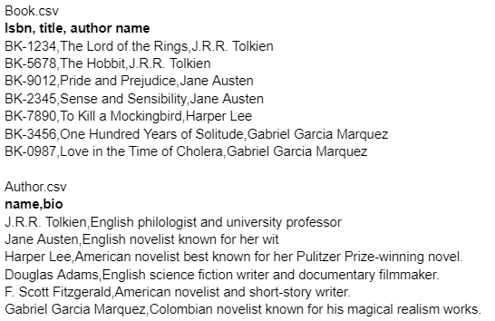
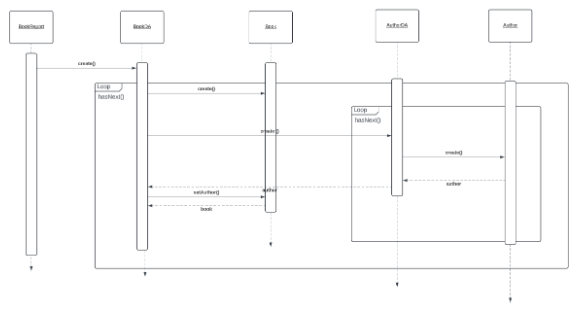
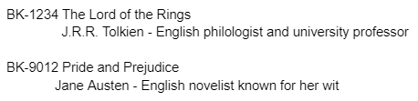

# OOP_LabSW5
Lab SW 5 HashMap Exercise

Create a report that will display the isbn, book title, author's name and bio based from the given diagram:

Use hashmap.  Use isbn as your key. Use FileReader in accessing the files.

Access the following files:

Use the following sequence diagram in the implementation of the codes:

Sample output:

